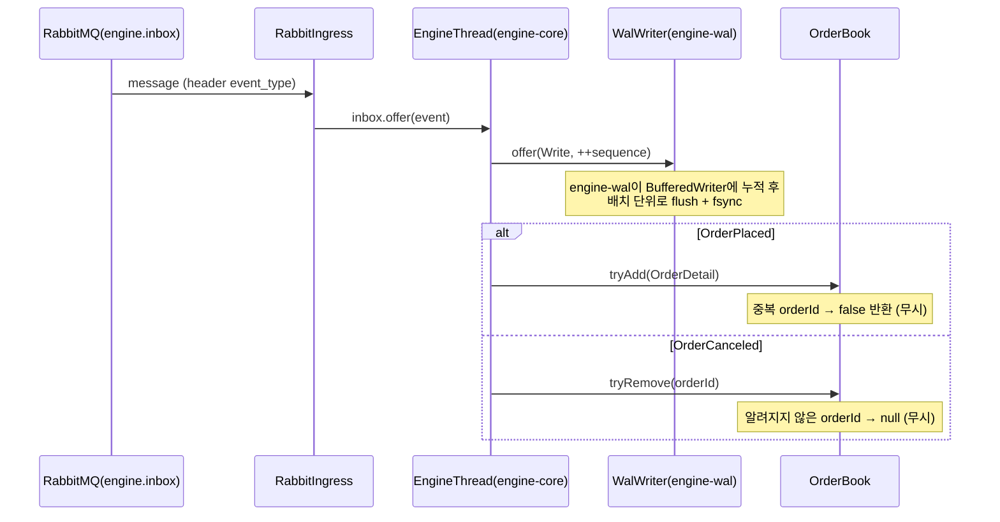

# `engine-core` 스레드

매칭 엔진의 단일 쓰기 스레드. `OrderBookRegistry`와 각 `OrderBook`을 소유하며, 인바운드 이벤트를 받아 장부를 변이하고 틱에 따라 체결 가능한 주문을 쓸어낸다.

- 소유 리소스: `OrderBookRegistry`, 각 `OrderBook`
- 입력: `EngineThread.inbox` (LinkedBlockingQueue, 16384)
- 하위 출력: `WalWriter.offer` (선행), `DbWriterThread.offer(FillCommand)` (체결 시)

상위 오케스트레이션·이벤트 흐름은 [`architecture.md`](../architecture.md) 참조.

---

## 1. 책임 범위

엔진의 책임은 "오더북 유지 + 틱 트리거 판정"으로 한정된다. 주문 금액 검증, 수수료 계산, 체결 수량 소수점 절사 같은 비즈니스 규칙은 상위 `trypto-api`가 주문 생성 시점에 확정해 `OrderPlacedEvent`에 담아 보낸다. 엔진은 그 값을 있는 그대로 소비할 뿐이고, DB·잔고·홀딩 접근은 전부 `FillCommand` → `DbWriterThread` 경유다.

---

## 2. OrderBook 자료구조

- `bids`: `TreeMap<BigDecimal, List<Long>>` (역순) — 높은 가격부터 정렬
- `asks`: `TreeMap<BigDecimal, List<Long>>` — 낮은 가격부터 정렬
- `orderIndex`: `Map<Long, OrderDetail>` — 주문 ID 기반 O(1) 조회
- 장부는 `OrderBookRegistry`가 `TradingPair`(=`exchangeCoinId`) 별로 하나씩 관리한다
- 모든 필드는 `engine-core` 스레드에서만 접근한다 (동기화 없음)

---

## 3. 주문 등록 / 취소

- `tryAdd(OrderDetail)`: `orderIndex`에 이미 존재하는 `orderId`면 `false` 반환. 중복 주문은 조용히 무시한다 (RabbitMQ at-least-once + WAL 복구 리플레이로 중복 가능)
- `tryRemove(Long orderId)`: 인덱스에서 제거하고 가격 버킷에서도 제거한다. 버킷이 비면 가격 키를 지운다. 알려지지 않은 `orderId`는 `null` 반환으로만 알린다

---

## 4. 틱 기반 sweep

- `TickReceivedEvent`가 오면 `ExchangeCoinResolver`로 `exchangeCoinId`를 해석한 뒤 해당 `OrderBook.sweep(tickPrice)` 호출
- `bids` 중 가격이 `tickPrice` 이상인 모든 주문과 `asks` 중 가격이 `tickPrice` 이하인 모든 주문을 순회하여 `triggered` 리스트에 모은다
- 트리거된 주문은 순서대로 `tryRemove`되고 `FillCommand`로 변환되어 `DbWriterThread`에 넘겨진다
- 체결 가격은 주문의 지정가가 아닌 **틱 가격**이다 (시뮬레이션 특성)

---

## 5. 체결 규칙

| 항목 | 값 |
|------|-----|
| 부분 체결 | 없음. `sweep`에 걸린 주문은 전량 체결되고 장부에서 즉시 제거 |
| 체결 가격 | `TickReceivedEvent.tradePrice` (지정가/시장가 구분 없이 틱 가격 고정, 시뮬레이션 특성) |
| 체결 수량 | `OrderDetail.quantity` 원 주문 수량 그대로. 분할/반올림 없음 |

---

## 6. 체크포인트 트리거

- `checkpointIntervalEvents`(기본 1000) 단위로 `checkpoint()` 호출
- 순서: `SnapshotWriter.write(registry, seq)` → `WalWriter.rotate()`
- WAL rotate의 파일 수준 동작은 [`engine-wal.md`](engine-wal.md) 참조

---

## 7. 멱등성 / 순서 보장

인바운드 이벤트는 단일 컨슈머(`@RabbitListener(concurrency = "1")`) → 단일 `engine-core` 스레드를 거치므로 FIFO가 유지된다. 중복은 아래와 같이 흡수된다.

| 이벤트 | 중복 유입 시 | 판정 키 | 보장 위치 |
|--------|--------------|---------|-----------|
| `OrderPlaced` | `tryAdd` → `false` 반환, 조용히 무시 | `orderId` | `OrderBook.orderIndex` |
| `OrderCanceled` | 알려지지 않은 `orderId`는 `null` 반환, 무시 | `orderId` | `OrderBook.orderIndex` |
| `TickReceived` | 매 이벤트 그대로 `sweep` 실행 (상태 무관) | — | — |

중복이 생기는 근거(RabbitMQ at-least-once / WAL append-then-process / 부팅 리플레이)는 [`architecture.md` §6](../architecture.md) 참조.

---

## 8. 설정 파라미터

| 키 | 기본값 | 바인딩 | 영향 |
|----|--------|--------|------|
| `engine.inbox.queue` | `engine.inbox` | `RabbitConfig` | 인바운드 RabbitMQ 큐 이름 |
| `engine.inbox.queue-capacity` | 16384 | `EngineThread.inbox` | 인바운드 BlockingQueue 용량 — backpressure 임계 |
