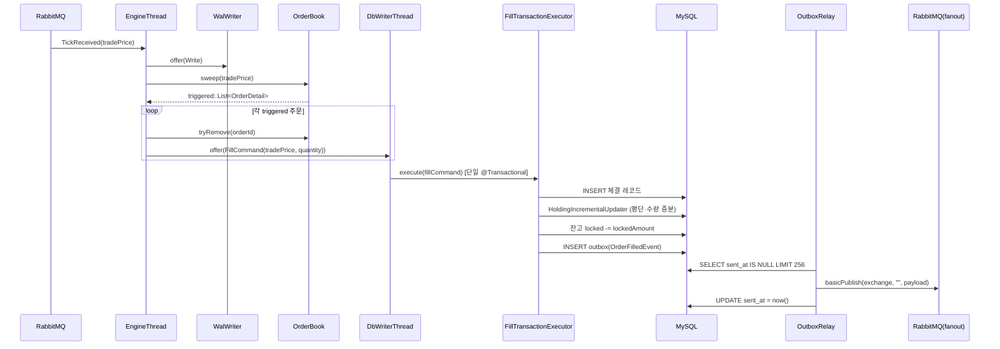

# `engine-dbwriter` 스레드

체결 결과를 DB에 영속화하는 스레드. `engine-core`이 큐로 넘긴 `FillCommand`를 꺼내 단일 트랜잭션으로 체결 레코드·홀딩·잔고·아웃박스를 묶어 쓴다.

---

## 1. 체결 후처리 파이프라인

1. `DbWriterThread`가 `FillCommand`를 큐에서 꺼낸다
2. `FillTransactionExecutor`가 단일 `@Transactional` 내에서 다음을 순차 수행한다:
   - 체결 레코드 INSERT
   - `HoldingIncrementalUpdater`로 평단·수량 증분 업데이트
   - 잔고 해제: `OrderPlaced.lockedAmount` / `lockedCoinId`를 그대로 사용해 `locked -= lockedAmount` UPDATE
   - `outbox` 테이블에 `OrderFilledEvent` INSERT

---

## 2. outbox INSERT가 같은 트랜잭션에 묶이는 이유

체결 INSERT · 홀딩 · 잔고 UPDATE와 함께 `outbox` INSERT를 **하나의 `@Transactional` 안에** 넣어야, 커밋이 성공하는 순간 "체결은 DB에 반영됐는데 이벤트는 발행되지 않은" 불일치가 원천 차단된다.

- 만약 `outbox` INSERT를 별도 트랜잭션으로 분리하면 체결 커밋 후 앱 크래시 시 아웃바운드 이벤트가 영영 발행되지 않는다
- RabbitMQ 직접 발행을 같은 트랜잭션에 섞을 수도 없다 — DB 커밋과 브로커 ack 사이의 원자성이 깨지기 때문. 그래서 "DB에만 기록하고 이후 발행은 별도의 스케쥴러에게 넘긴다"는 아웃박스 패턴을 채택했다
- 발행 실패(RabbitMQ 일시 장애 등)는 `OutboxRelay`가 `sent_at IS NULL` 레코드를 다음 폴링에서 재시도하므로 at-least-once가 보장된다

---

## 3. 배치 쓰기

한 번의 sweep이 여러 건의 체결을 만들 수 있으므로, 이 스레드가 내는 체결·`outbox` INSERT와 잔고 UPDATE는 JDBC 배치로 모아 한 번의 네트워크 왕복으로 MySQL에 전달된다. 따라서 주문 N건이 한 번에 체결되어도 쿼리는 종류별 1회로 축약된다.

---

## 4. 설정 파라미터

처리량을 위해 HikariCP MySQL 권장 옵션을 사용한다 

| 키 (`spring.datasource.hikari.data-source-properties.*`) | 기본값 | 영향 |
|----|--------|------|
| `cachePrepStmts` | `true` | 클라이언트 측 PreparedStatement 캐시 활성화 |
| `prepStmtCacheSize` | `250` | 커넥션당 캐시할 PreparedStatement 수 |
| `prepStmtCacheSqlLimit` | `2048` | 캐시 대상 SQL의 최대 길이(문자) |
| `useServerPrepStmts` | `true` | 서버 사이드 prepared statement 사용 (바인드 파라미터 네이티브 처리) |
| `rewriteBatchedStatements` | `true` | `INSERT ... VALUES (...)` 배치를 멀티 VALUES 한 문장으로 재작성 — 체결·아웃박스 INSERT 처리량에 직결 |
| `useLocalSessionState` | `true` | autocommit/isolation 등 세션 상태를 로컬에서 추적해 불필요한 왕복 제거 |
| `cacheServerConfiguration` | `true` | 커넥션 초기화 시 받는 서버 변수들을 커넥션 수명 동안 캐시 |
| `cacheResultSetMetadata` | `true` | ResultSet 메타데이터 재조회 회피 |

