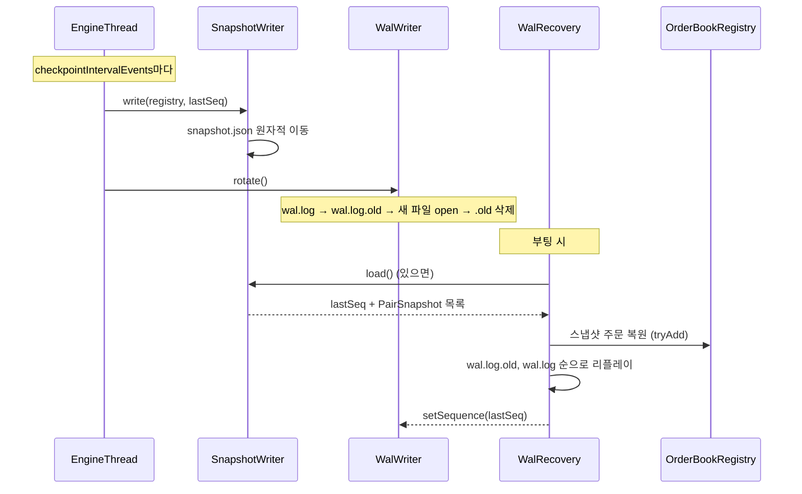

# `engine-wal` 스레드

WAL 파일 핸들과 `sequence`를 소유하는 스레드. `engine-core`이 큐로 보낸 `WalCommand`를 배치로 묶어 flush + fsync한다.

- 소유 리소스: WAL 파일 핸들, `sequence`
- 입력: `WalWriter.channel` (LinkedBlockingQueue, 16384)
- 파일: `${engine.wal.dir}/wal.log`, `wal.log.old`, `snapshot.json`

---

## 1. Append-then-process

- `EngineThread.loop`는 이벤트를 큐에서 꺼낸 즉시 `walWriter.offer(event)`를 호출한 뒤 장부를 변이한다
- `WalWriter.offer`는 호출 스레드(`engine-core`)에서 시퀀스를 `++sequence`로 발급하고 `WalCommand.Write`를 `engine-wal` 큐에 넣고 반환한다 (fsync 대기 없음)
- 따라서 엔진 처리 시점과 WAL 파일에 실제 flush되는 시점 사이에 짧은 지연이 존재한다. 크래시 시 손실되는 테일은 최대 한 배치 분량

---

## 2. 배치 fsync

- `engine-wal` 스레드는 채널에서 커맨드를 꺼내 최대 `BATCH_MAX=100`까지 drain한 뒤 한 번에 처리한다
- 같은 배치 내의 `Write`는 `BufferedWriter`에 누적만 하고, 배치 끝(혹은 `Flush`/`Rotate` 커맨드)에서 `writer.flush() + FileDescriptor.sync()`를 단일로 수행한다
- WAL append Timer 샘플은 **배치당 1회**만 측정한다 (커밋 `33ecb19`)

---

## 3. 체크포인트 / 복구



### Rotate

- `rotate()`는 체크포인트 시점에 `engine-core`이 호출한다
- 현재 `wal.log`를 `wal.log.old`로 이동 후 새 파일을 열고 `.old`를 삭제한다

### 복구

- `WalRecovery.recover(registry)`가 시작 시 호출되어:
  1. 스냅샷이 있으면 로드하여 `OrderBookRegistry`를 복원하고 해당 `lastSeq`를 반환
  2. `wal.log`를 시퀀스 순으로 리플레이하여 장부 상태를 재구성
- 반환된 `lastSeq`로 `WalWriter.setSequence`를 호출해 시퀀스 연속성을 유지한다
- 리플레이는 멱등해야 한다 — 중복 `OrderPlaced`는 `tryAdd`가 무시, 알려지지 않은 `OrderCanceled`는 `tryRemove`가 무시

---

## 4. 파일 레이아웃 및 포맷

기본 디렉터리는 `${engine.wal.dir}` (기본값 `./wal`).

| 파일 | 포맷 | 용도 |
|------|------|------|
| `wal.log` | 줄 단위 JSON (NDJSON) | 현재 append 대상 |
| `wal.log.old` | 동일 | rotate 직후 잠시 존재, 다음 rotate에서 삭제 |
| `snapshot.json` | 단일 JSON | 최신 체크포인트. 원자적 이동으로 교체 |

**WAL 레코드 (`wal.log` 한 줄)**

```json
{"sequence":12345,"eventType":"OrderPlaced","event":{"orderId":42,"userId":7,"walletId":2,"side":"BUY","exchangeCoinId":11,"coinId":3,"baseCoinId":1,"price":100000000,"quantity":0.005,"lockedAmount":500000,"lockedCoinId":1,"placedAt":"2026-02-21T14:30:00"}}
```

- `sequence`: `WalWriter`가 발급하는 단조 증가 long. 리플레이 시 정렬 키
- `eventType`: `OrderPlaced` / `OrderCanceled` / `TickReceived` 중 하나
- `event`: 인바운드 이벤트 payload를 Jackson으로 직렬화한 JsonNode

**스냅샷 (`snapshot.json`)**

```json
{
  "lastSeq": 123000,
  "pairs": [
    {
      "exchangeCoinId": 11,
      "orders": [ { "orderId": 42, "side": "BUY", "price": 100000000, "quantity": 0.005, ... } ]
    }
  ]
}
```

- `lastSeq`: 스냅샷이 반영하는 마지막 WAL 시퀀스. 복구 시 `WalWriter.setSequence`의 시작값
- 부팅 복구 순서: 스냅샷 로드 → `wal.log.old` 리플레이 → `wal.log` 리플레이 (모두 `sequence > lastSeq`만 적용)

---

## 5. 멱등성 / 순서 보장

리플레이는 `sequence` 오름차순으로 재적용되며, 스냅샷 `lastSeq` 이하는 드롭된다. 개별 이벤트의 중복 흡수는 장부 쪽(`tryAdd` / `tryRemove`)에 위임되므로 [engine-core §7](engine-core.md) 참조.

| 경로 | 중복 유입 시 | 순서 보장 | 판정 키 | 보장 위치 |
|------|--------------|-----------|---------|-----------|
| WAL 리플레이 | 스냅샷 `lastSeq` 이하 드롭 + 장부 쪽 멱등 재사용 | 시퀀스 오름차순 | `sequence` | `WalRecovery` |

---

## 6. 설정 파라미터

| 키 | 기본값 | 바인딩 | 영향 |
|----|--------|--------|------|
| `engine.wal.dir` | `./wal` | `WalWriter` / `SnapshotWriter` | WAL, snapshot 파일 루트 |
| `engine.wal.batch-max` | 100 | `WalWriter.BATCH_MAX` | 한 번의 flush+fsync에 묶이는 최대 레코드 수 |
| `engine.wal.checkpoint-interval-events` | 1000 | `EngineThread` | 체크포인트(스냅샷 + rotate) 주기, 처리 이벤트 수 기준 |
